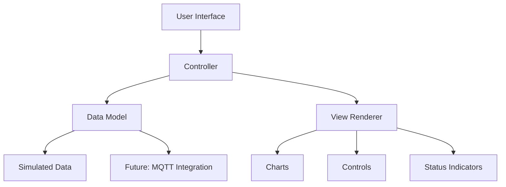
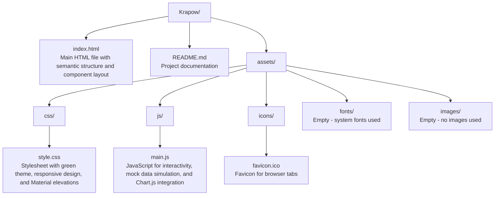
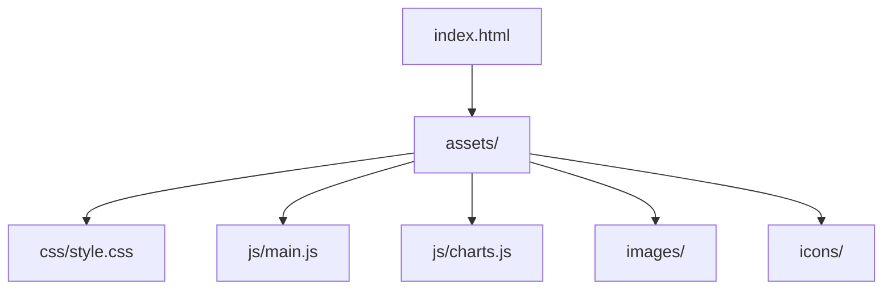

# Krapow Smart Greenhouse Dashboard

A responsive web-based dashboard for monitoring and controlling multiple smart greenhouses, specifically designed for optimal Thai basil (holy basil) cultivation. The name "Krapow" refers to the popular Thai basil stir-fry dish, highlighting the project's focus on basil cultivation.

## Table of Contents

- [Overview](#overview)
- [Key Features](#key-features)
- [System Architecture](#system-architecture)
- [Technical Implementation](#technical-implementation)
- [Project Structure](#project-structure)
- [Installation Guide](#installation-guide)
- [User Guide](#user-guide)
- [Development Setup](#development-setup)
- [Future Roadmap](#future-roadmap)
- [Browser Compatibility](#browser-compatibility)
- [Contributing](#contributing)
- [License](#license)

## Overview

The Krapow Smart Greenhouse Dashboard provides real-time monitoring and control for up to 10 smart greenhouses. The system is designed to maintain optimal growing conditions for Thai basil through precise environmental control and monitoring.

### Key Benefits

- Real-time monitoring of critical environmental parameters
- Remote control of greenhouse systems
- Data visualization for better decision making
- Scalable architecture for multiple greenhouse units
- Responsive design for access on any device

## Key Features

### 1. Multi-Greenhouse Management
- Monitor and control up to 10 individual greenhouses
- Quick switching between greenhouse units
- Individual status overview for each unit

### 2. Environmental Monitoring
| Parameter | Range | Optimal Range |
|-----------|-------|---------------|
| Temperature | 15-40°C | 24-28°C |
| Humidity | 20-95% | 55-70% |
| Soil Moisture | 0-100% | 35-55% |
| Light | 0-100% | 12-16h photoperiod |

### 3. Control Systems
- **Pump Control**: Manage irrigation systems
- **Fan Control**: Regulate temperature and airflow
- **Lighting Control**: Adjust grow lights
- **Misting System**: Control humidity levels

### 4. Data Visualization
- Real-time charts for all metrics
- Historical data trends
- Visual indicators for out-of-range conditions

### 5. User Interface
- Clean, intuitive dashboard
- Responsive design for all devices
- Accessibility compliant (WCAG 2.1)
- Real-time action logging

## System Architecture

The application follows a client-side architecture with the following components:



### Component Breakdown

1. **Presentation Layer**
   - Responsive UI components
   - Real-time data visualization
   - User interaction handling

2. **Application Layer**
   - State management
   - Data processing
   - Event handling

3. **Data Layer**
   - Current: In-memory data simulation
   - Future: MQTT-based real-time data streaming

### Data Flow

1. User interacts with the dashboard
2. Controller processes the action
3. Data model updates accordingly
4. View re-renders to reflect changes
5. (Future) Commands sent to physical devices via MQTT

## Technical Implementation

### Core Technologies

| Technology | Purpose | Version |
|------------|---------|---------|
| HTML5 | Structure & Semantics | 5.3 |
| CSS3 | Styling & Layout | 3.0 |
| JavaScript | Interactivity | ES6+ |
| Chart.js | Data Visualization | 3.9.1 |
| Chart.js Date Adapter | Time-based Charts | 2.0.0 |

### Key Dependencies

- **Chart.js**: For rendering interactive charts
- **date-fns**: Date manipulation for chart axes
- **Material Design**: UI/UX inspiration and patterns

### Development Tools

- No build tools required for basic operation
- VS Code recommended for development
- Browser DevTools for debugging

## Project Structure

```
Krapow/
├── index.html                 # Main application entry point
├── README.md                  # Project documentation
├── assets/
│   ├── css/
│   │   └── style.css          # Main stylesheet with theming and responsive design
│   ├── js/
│   │   ├── main.js            # Core application logic
│   │   └── charts.js          # Chart initialization and updates
│   ├── icons/                 # Application icons and favicon
│   ├── images/                # Static image assets
│   └── tmp/                   # Temporary files (e.g., mock camera images)
├── sw.js                      # Service worker for PWA capabilities
└── site.webmanifest           # Web app manifest for PWA installation
```

### Key Files

- `index.html`: Main application structure and layout
- `assets/css/style.css`: Styling and theming
- `assets/js/main.js`: Core application logic and state management
- `sw.js`: Service worker for offline functionality
- `site.webmanifest`: PWA configuration



Key files:

- [`index.html`](index.html): Entry point with HTML structure, including headers, metrics cards, chart canvas, and control forms.
- [`assets/css/style.css`](assets/css/style.css): Comprehensive stylesheet defining the soft green theme, responsive breakpoints, and UI components.
- [`assets/js/main.js`](assets/js/main.js): Core logic for state management, rendering, event handling, and mock data updates.

## Installation Guide

### Prerequisites
- Modern web browser (Chrome, Firefox, Safari, or Edge)
- Git (for development)
- Node.js (optional, for development server)

### Quick Start

1. Clone the repository:
   ```bash
   git clone https://github.com/yourusername/panuwat.github.io.git
   cd panuwat.github.io/krapow
   ```

2. Open in browser:
   - Double-click `index.html` or
   - Use a local web server:
     ```bash
     # Python 3
     python -m http.server 8000
     # Then visit http://localhost:8000/krapow
     ```

3. The dashboard will load with simulated data, updating every 3 seconds.

### Development Setup

For development, we recommend using a local server to avoid CORS issues:

```bash
# Using Node.js http-server
npm install -g http-server
http-server -p 8000
```

Then open `http://localhost:8000` in your browser.

## User Guide

### Dashboard Overview

The dashboard is organized into several key sections:

1. **Header**
   - Application logo
   - Greenhouse selector tabs (KP 1-10)
   - Current greenhouse status indicator

2. **Metrics Panel**
   - Real-time environmental data
   - Visual gauges and trend indicators
   - Color-coded status indicators

3. **Control Panel**
   - Device toggles (Pump, Fan, Light, Mist)
   - Operation mode selection
   - Timing controls

### Basic Operations

#### Viewing Greenhouse Data
1. Select a greenhouse using the tabs (KP 1-10)
2. View current metrics in the gauges
3. Check the temperature trend in the chart
4. Review system status in the log panel

#### Controlling Devices
1. Select the desired greenhouse
2. Choose operation mode:
   - **On/Off**: Manual control
   - **Pulse**: Timed activation
   - **Auto**: Automatic control (future)
3. Set duration (for Pulse mode)
4. Click the device button to toggle state

### Advanced Features

#### Data Visualization
- Hover over chart points for detailed values
- Click and drag to zoom
- Double-click to reset zoom
- Toggle metrics using the legend

#### Keyboard Shortcuts
- `1-0`: Switch between greenhouses
- `P`: Toggle Pump
- `F`: Toggle Fan
- `L`: Toggle Light
- `M`: Toggle Misting

## Development Setup

### Project Structure



### Development Workflow

1. Make changes to source files
2. Test in development server
3. Check browser console for errors
4. Validate HTML/CSS/JS
5. Commit changes with descriptive messages

### Testing

1. Test all greenhouse tabs
2. Verify responsive behavior
3. Check accessibility
4. Test all control functions
5. Verify data updates

## Future Roadmap

### Short-term Goals
- [ ] Implement MQTT integration
- [ ] Add user authentication
- [ ] Improve mobile experience
- [ ] Add data export functionality

### Long-term Vision
- [ ] Mobile app integration
- [ ] Advanced analytics
- [ ] Machine learning for optimization
- [ ] Multi-user support with roles

## Browser Compatibility

The dashboard is tested and works on:

- Chrome 90+
- Firefox 85+
- Safari 14+
- Edge 90+

### Known Issues
- Limited offline functionality
- No data persistence between sessions
- Basic error handling

## Contributing

We welcome contributions! Please follow these steps:

1. Fork the repository
2. Create a feature branch
3. Make your changes
4. Submit a pull request

### Development Guidelines
- Follow existing code style
- Write clear commit messages
- Document new features
- Test thoroughly

## License

MIT License

Copyright (c) 2025 Panuwat Sangketkit

Permission is hereby granted, free of charge, to any person obtaining a copy
of this software and associated documentation files (the "Software"), to deal
in the Software without restriction, including without limitation the rights
to use, copy, modify, merge, publish, distribute, sublicense, and/or sell
copies of the Software, and to permit persons to whom the Software is
furnished to do so, subject to the following conditions:

The above copyright notice and this permission notice shall be included in all
copies or substantial portions of the Software.

THE SOFTWARE IS PROVIDED "AS IS", WITHOUT WARRANTY OF ANY KIND, EXPRESS OR
IMPLIED, INCLUDING BUT NOT LIMITED TO THE WARRANTIES OF MERCHANTABILITY,
FITNESS FOR A PARTICULAR PURPOSE AND NONINFRINGEMENT. IN NO EVENT SHALL THE
AUTHORS OR COPYRIGHT HOLDERS BE LIABLE FOR ANY CLAIM, DAMAGES OR OTHER
LIABILITY, WHETHER IN AN ACTION OF CONTRACT, TORT OR OTHERWISE, ARISING FROM,
OUT OF OR IN CONNECTION WITH THE SOFTWARE OR THE USE OR OTHER DEALINGS IN THE
SOFTWARE.

## Development

To contribute or extend the project:

1. Edit files directly in a code editor (e.g., VS Code).
2. Test changes by opening [`index.html`](index.html) in a browser.
3. For Chart.js modifications, refer to the [`ensureChart`](assets/js/main.js) and [`updateChartSeries`](assets/js/main.js) functions in [`assets/js/main.js`](assets/js/main.js).
4. Style updates can be made in [`assets/css/style.css`](assets/css/style.css), leveraging CSS custom properties for theming.
5. Add new features by extending the state in [`ghStates`](assets/js/main.js) or adding event listeners.

No linting or testing frameworks are currently set up; consider adding ESLint and Jest for code quality.

## Future Enhancements

- Integrate with MQTT (e.g., via MQTT.js) for real sensor data and device control.
- Add user authentication and multi-user support with role-based access.
- Implement data persistence using IndexedDB or a backend API for historical analytics.
- Add alerts and notifications for out-of-range conditions.
- Support for additional sensors (e.g., CO2, pH) and actuators.
- Progressive Web App (PWA) features for offline access and push notifications.
- API endpoints for data export and integration with external systems.

## Browser Support

- Modern browsers with ES6 support (Chrome 60+, Firefox 55+, Safari 11+, Edge 79+).
- Tested on desktop (Windows, macOS, Linux) and mobile (iOS, Android) viewports.
- Requires JavaScript enabled; no polyfills included.

## Contributing

Contributions are welcome! Please fork the repository, create a feature branch, and submit a pull request. Ensure code follows ES6+ standards and includes comments for complex logic.

## License

Copyright © 2025 Panuwat Sangketkit

This project is licensed under the [MIT License](LICENSE).
