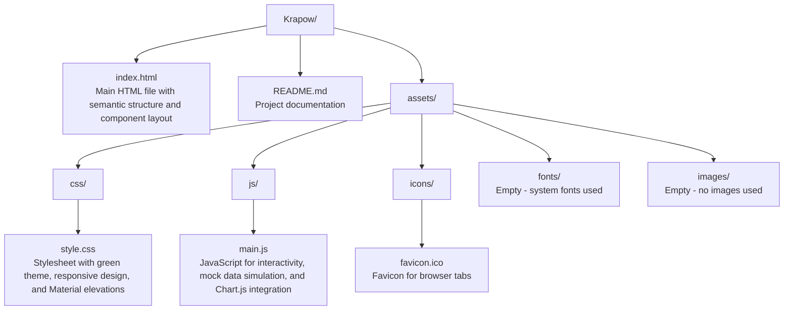

# Krapow Smart Greenhouse Dashboard

A web-based dashboard for monitoring and controlling multiple smart greenhouses, designed for basil cultivation ("Krapow" refers to Thai basil stir-fry).

## Table of Contents

- [Krapow Smart Greenhouse Dashboard](#krapow-smart-greenhouse-dashboard)
  - [Table of Contents](#table-of-contents)
  - [Overview](#overview)
  - [Features](#features)
  - [System Architecture](#system-architecture)
  - [Tech Stack](#tech-stack)
  - [Project Structure](#project-structure)
  - [Installation and Setup](#installation-and-setup)
  - [Usage](#usage)
  - [Development](#development)
  - [Future Enhancements](#future-enhancements)
  - [Browser Support](#browser-support)
  - [Contributing](#contributing)
  - [License](#license)

## Overview

The Krapow Smart Greenhouse Dashboard is a responsive, client-side web application built to monitor and control up to 10 smart greenhouses optimized for Thai basil (holy basil) cultivation. It provides real-time visualization of environmental metrics such as temperature, humidity, soil moisture, and light levels, along with interactive controls for actuators like irrigation pumps, fans, lights, and misting systems. Currently, the application uses simulated data for demonstration purposes, with a clear path for integration with MQTT-based IoT systems for live sensor data and device control.

This project demonstrates modern front-end development practices, including modular JavaScript, responsive CSS design, and data visualization using Chart.js. It's ideal for agricultural IoT applications, offering a scalable UI that can handle multi-greenhouse scenarios.

## Features

- **Multi-Greenhouse Support**: Monitor up to 10 greenhouses (KP 1 through KP 10) with tabbed navigation.
- **Real-Time Metrics**: Displays temperature, humidity, soil moisture, and light levels with target ranges.
- **Temperature Chart**: Interactive Chart.js visualization showing temperature trends over the last hour.
- **Control Panel**: Buttons to control irrigation pump, ventilation fan, grow lights, and misting system.
- **Responsive Design**: Material Design-inspired UI with a soft green theme, optimized for desktop and mobile.
- **Mock Data Simulation**: Currently uses simulated data; designed for MQTT integration.
- **Action Logging**: Real-time logs for control actions and acknowledgments.
- **Accessibility**: Semantic HTML, ARIA labels, and keyboard navigation support.

## System Architecture

The application follows a simple, client-side architecture suitable for static web deployment:

- **Frontend Layer**: A single-page application (SPA) built with vanilla HTML, CSS, and JavaScript. No backend is required, as data is currently mocked.
- **Data Layer**: In-memory state management for greenhouse data, including time-series for charts and current metrics. Data updates are simulated via JavaScript intervals.
- **UI Components**:
  - Header with collapsible app bar and greenhouse tabs.
  - Metrics cards displaying key indicators.
  - Chart panel for temperature visualization.
  - Control panel with forms and buttons for device actions.
- **Event Handling**: DOM events for user interactions (e.g., tab switching, button clicks), with mock MQTT publishing simulated through logging.
- **Responsiveness**: CSS Grid and Flexbox for adaptive layouts across devices.

Future integration with MQTT will introduce a communication layer for real-time data streaming and command publishing.

## Tech Stack

- **HTML5**: Semantic structure, accessibility features, and responsive meta tags.
- **CSS3**: Custom properties (CSS variables) for theming, responsive grid layouts, Material Design elevations, and mobile-first design.
- **JavaScript (ES6+)**: Modular code with IIFE for encapsulation, DOM manipulation, event handling, and Chart.js integration.
- **Chart.js**: Open-source library for rendering interactive charts with custom gradients and animations.
- **No Build Tools**: Pure static files; no bundlers, transpilers, or package managers required for basic operation.

## Project Structure

```text
Krapow/
├── index.html                 # Main HTML file with semantic structure and component layout
├── README.md                  # Project documentation
├── assets/
│   ├── css/
│   │   └── style.css          # Stylesheet with green theme, responsive design, and Material elevations
│   ├── js/
│   │   └── main.js            # JavaScript for interactivity, mock data simulation, and Chart.js integration
│   ├── icons/
│   │   └── favicon.ico        # Favicon for browser tabs
│   ├── fonts/                 # (Empty - system fonts used)
│   └── images/                # (Empty - no images used)
```



Key files:

- [`index.html`](index.html): Entry point with HTML structure, including headers, metrics cards, chart canvas, and control forms.
- [`assets/css/style.css`](assets/css/style.css): Comprehensive stylesheet defining the soft green theme, responsive breakpoints, and UI components.
- [`assets/js/main.js`](assets/js/main.js): Core logic for state management, rendering, event handling, and mock data updates.

## Installation and Setup

1. Clone or download the project repository to your local machine.
2. Ensure you have a modern web browser installed (e.g., Chrome, Firefox, Safari, Edge).
3. Open [`index.html`](index.html) directly in your browser—no server or build process is required.
4. The dashboard will initialize with simulated data, updating every 3 seconds.

For development, you can serve the files via a local HTTP server (e.g., using Python's `http.server` or Node.js's `http-server`) to avoid CORS issues with external scripts like Chart.js.

## Usage

- **Switch Greenhouses**: Click the tabs (KP 1-10) in the header to view data for different greenhouses.
- **View Metrics**: Review current values and targets for temperature (24-28°C), humidity (55-70%), soil moisture (35-55%), and light (12-16h photoperiod) in the metrics cards.
- **Temperature Chart**: Interact with the Chart.js visualization to explore temperature trends over the last hour.
- **Control Devices**:
  - Select mode: Pulse (timed activation), On, or Off.
  - Set duration (in seconds) and delay (in seconds) if needed.
  - Click buttons for Pump, Fan, Light, or Mist to trigger actions.
  - Confirm actions in the browser's confirmation dialog.
- **Logs**: Monitor action logs in the control panel's log area for published commands and acknowledgments.

All actions are currently mocked; integrate with MQTT for real device control.

## Development

To contribute or extend the project:

1. Edit files directly in a code editor (e.g., VS Code).
2. Test changes by opening [`index.html`](index.html) in a browser.
3. For Chart.js modifications, refer to the [`ensureChart`](assets/js/main.js) and [`updateChartSeries`](assets/js/main.js) functions in [`assets/js/main.js`](assets/js/main.js).
4. Style updates can be made in [`assets/css/style.css`](assets/css/style.css), leveraging CSS custom properties for theming.
5. Add new features by extending the state in [`ghStates`](assets/js/main.js) or adding event listeners.

No linting or testing frameworks are currently set up; consider adding ESLint and Jest for code quality.

## Future Enhancements

- Integrate with MQTT (e.g., via MQTT.js) for real sensor data and device control.
- Add user authentication and multi-user support with role-based access.
- Implement data persistence using IndexedDB or a backend API for historical analytics.
- Add alerts and notifications for out-of-range conditions.
- Support for additional sensors (e.g., CO2, pH) and actuators.
- Progressive Web App (PWA) features for offline access and push notifications.
- API endpoints for data export and integration with external systems.

## Browser Support

- Modern browsers with ES6 support (Chrome 60+, Firefox 55+, Safari 11+, Edge 79+).
- Tested on desktop (Windows, macOS, Linux) and mobile (iOS, Android) viewports.
- Requires JavaScript enabled; no polyfills included.

## Contributing

Contributions are welcome! Please fork the repository, create a feature branch, and submit a pull request. Ensure code follows ES6+ standards and includes comments for complex logic.

## License

Copyright © 2025 Panuwat Sangketkit

This project is licensed under the [MIT License](LICENSE).
